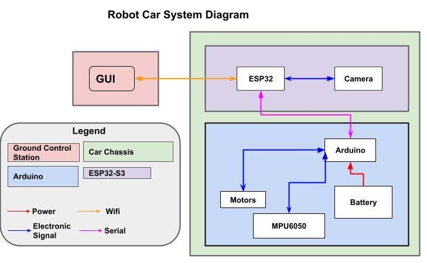

# ELEGOO Robot Car 2D Position and Orientation Tracking

This repo contains code for the Elegoo Smart Robot Car Kit V4.0 to allow for 2D position and orientation tracking using a Kalman filter.

It also supports a system of movement commands through an API available on the ESP32's network.

The API allows users to direct the car to a series of 2D Cartesian coordinates, with the starting position as 0,0.

Note that the starting orientation of the car is defined to be the Y axis and a 90 degree offset from that is the X axis, contrary to general robotics conventions.

Starting heading is defined to be 0.

This project is a modification of the original Elegoo software shipped with the car to add these capabilities.
The original source can be found at: https://www.elegoo.com/blogs/arduino-projects/elegoo-smart-robot-car-kit-v4-0-tutorial

The project supports only the version of the car containing the Arduino Uno, MPU 6050 intertial measurement unit, TB6612 motors, and ESP32-S3, though other hardware configurations of the Smart Robot Car V4.0 do exist.

## Installation
These instructions assume that you already have an assembled Elegoo Smart Robot Car Kit V4.0 with the hardware described above.

1. Download this project as a .zip file using the code dropdown menu or other means.
2. Unpack the files to some desireable location.
3. Download and set up the Arduino IDE for your operating system from https://www.arduino.cc/en/software/.
4. Open the project in the Arduino IDE. This can be done by opening the ElegooRobotCar.ino file. Other files in the project will be opened as well.
5. Select Arduino Uno from the dropdown menu at the top left or connect the car's Uno to your PC by USB to select it automatically.
6. Click the upload button to compile and upload the project into the car. 
The project is now installed and the car will run the project's code once turned on.

## Usage
Once the car is on, it will listen for move or turn commands sent by HTTP over its API. 

The user GUI, which sends these commands, can be found under the Pathing-Front-End repo in this project.

Commands can also be sent via curl with commands such as
```
curl -X POST http://192.168.4.1/api/path \
  -H "Content-Type: application/json" \
  -d '{"cmd":"move","d": .01,"dir":1}'
  
curl -X POST http://192.168.4.1/api/path \
  -H "Content-Type: application/json" \
  -d '{"cmd":"turn","a":90}'
  
curl http://192.168.4.1/api/pose 
```

In a move command, "d" is the distance in meters, and "dir" is 1 for forward and 0 for backwards.

In a turn command, "a" is the desired direction to face.

The car will execute commands until no more remain in queue, with a maximum number of stored commands at 5. 
Turn commands and move commands both take up a single space in the queue.

There are also built in test functions: 
- Application_FunctionSet.testBasicRoute() runs a basic 5 command route.
- Application_FunctionSet.testMoves() moves the car straight for 3 meters.
- Application_FunctionSet.testTurns() turns the car right 179 degrees and then back left to face a 1 degree heading.

These can be inserted to the setup() function in the ino file to insert their relevant commands into the queue.

## System Architecture


## Software Configuration
A few parts of the software can be reconfigured to account for differing hardware.

STANDARDSPEED in ApplicationFunctionSet_xx0.cpp can be altered to either increase or decrease the speed of the car.

### PID system
This project features a Proportional-Integral-Derivative controller system to keep the car moving in a straight line.

A STANDARDKP value is defined in ApplicationFunctionSet_xx0.cpp which controls how aggressively the controller attempts to correct course when drifting.

By default, this value is set to 12, but setting a higher value makes the system quicker to correct.

### Kalman Filter
The kalman filter works by comparing integrated acceleration to a dead reckoning model. Each method has an associated noise value.

These are accelNoise, a variable, and RECKONINGNOISE, a compiler defined value. In either case, a value closer to 0 places more trust in that method of prediction, and a higher value places less trust.

The dead reckoning method also relies on a linear approximation of the speed value given by the internal speed value passed to the filter. This is generally STANDARDSPEED in ApplicationFunctionSet_xx0.cpp.

This function can be altered in PositionTracking::internalSpeedToMPS as desired to match a given car, if the actual speed differs.

## Purposes of Files
- addLibrary directory:
    + Contains additional files included by the compiler
- 2DVelocity.h
    + Contains some inline functions used by the Kalman filter to get the proportion of velocity along each axis, and to turn raw accelerometer readings into usable units.
- ApplicationFunctionSet_xx0.cpp
    + Contains most of the code associated with physically operating the robot, such as motor controls, LED controls, etc.
    + Contains movement and turn handling
    + Contains the path action queue
    + Contains the code which monitors the API and handles requests
    + Contains definitions of STANDARDSPEED, STANDARDKP, etc.
- DeviceDriverSet_xxx0.cpp
    + Contains device drivers such as the ones for the motors, and lights.
- ElegooRobotCar.ino
    + Contains the main function, which is loop(), and the setup() function. 
- I2Cdev.cpp
    + Used in reading accelerometer bits.
- IRremote.cpp
    + Allows the use of the IR remote that comes with the car kit. Not used in this project.
- MEMORY_OPTIMIZATION_NOTES.txt
    + Contains some options for attemtping to reduce memory usage. 
    + Attempting to fit all the needed variables into the memory available was challenging in development, and you may want to use some of these suggestions if you intend to fork this project.
- MPU6050.cpp
    + Contains bitwise functions to read from and write to the MPU 6050. 
    + Called from MPU6050_getdata.cpp
- MPU6050_getdata.cpp
    + Contains higher level functions related to accelerometer readings.
- scalarPosition.cpp
    + Implements a scalarized Kalman filter in 2 dimensions using integrated acceleration and dead reckoning.

## Kalman Filter
### Kalman Filtering Generally:
Kalman filtering is a technique which uses a saved state, predicts changes in the state based on current values, then updates that prediction with an external observation of the system unrelated to the model. By doing this, it is possible to turn an unreliable model and an unreliable measurement into a more reliable estimation. 
Kalman filtering is often used in guidance and navigation to provide state estimates.
### Implementation:
The Kalman filter is implemented in scalarPosition.cpp, scalarPosition.h, and 2DVelocity.h.


In this project, our filter uses accelerometer measurements from the MPU6050, integrated to determine velocity and position for the model, and a measured speed at a given setting multiplied by time as an external measurement.
A heading is also derived from the MPU6050, and using trigonometry, we calculate cartesian coordinates to represent where the car is relative to its starting position in 2D space.
### Hardware Limitations:
We observed MPU6050 readings to range wildly as the car shakes. This causes the filter to depend more on the update stage, rather than on both parts equally. 
The car also lacks a physical way to truly measure its own position in real time, which is why the measured speed update is used over, for example, GPS position. This is still consistent with theory, as the measured speed is external to the integrated acceleration model.


## Pathing Handling
Once added to the queue of PathAction structs, actions are handled by the handleAction function in the order received.

For move commands, handleMoves is called, which sets the motors to move at the standard speed while continuously updating the Kalman filter.

Once the Kalman filter believes that it is within a few cm of the desired location, the move command is considered complete.

The car's heading will be updated with a check to the MPU 6050's gyroscope, and the function will return.

For turn commands, handleTurns is called, which sets the motors for a differential turn and continues until the MPU 6050's reported heading matches the desired heading.

The Kalman filter is not updated during turns to avoid confusing it.

## API
The API has two addresses, one for receiving PathActions and another for reporting position.

Move commands can be sent as POSTs to http://192.168.4.1/api/path. The GUI does this automatically, but curl commands like shown above can also be used.

The car will respond to GET requests to http://192.168.4.1/api/pose with its cartesian coordinates.

## Known Limitations
Accelerometer readings can be very noisy with the MPU 6050, so the Kalman filter puts little trust in integrated acceleration by default. This results in an outcome that trusts the dead reckoning model disproportionately.

Turns can sometimes be thrown off when the car has too little traction or too much vibration.

With the full project loaded onto the car, there is very little room left over for anything else. The code in this repo takes up roughly 95% of the text space on the Arduino Uno. Global variables take up a further 1389 bytes currently, leaving 659 bytes for both the stack and heap, which of course are used during function calls. If you want to add to this project, you will most likely need to remove some code.

